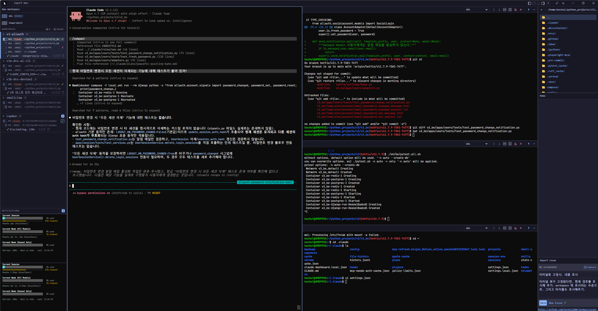

<p align="center">
  
</p>

<h1 align="center">Laymux</h1>

<p align="center">
  A keyboard-first multi-pane terminal IDE built for<br/>
  <strong>Windows + WSL, Claude Code, Codex CLI, and CJK/IME</strong> users.
</p>

<p align="center"><a href="./README.ko.md">한국어</a></p>



## Why Laymux

Modern terminal workflows on Windows increasingly run through WSL shells, AI coding agents (Claude Code, Codex CLI), and CJK input methods — but most terminal UIs treat these as afterthoughts. Laymux is designed around them from the start:

- **Multiple WSL/PowerShell terminals** sit side-by-side in a ratio-based grid, each with its own profile, CWD, and sync policy — no tabs to juggle, no window management overhead.
- **Claude Code and Codex are first-class citizens**: Laymux knows when they're thinking, idle, or finished, and surfaces that state in the workspace selector and notifications.
- **Hangul, Japanese, and Chinese IME input** uses a shadow-cursor layer that keeps the composition box glued to the real xterm.js cursor instead of drifting across the screen during TUI repaints.
- **AI agents can drive the IDE itself** — a built-in HTTP REST API + MCP server lets external LLMs open panes, run commands, capture output, and take screenshots.

## Built For

### Windows + WSL users
Ratio-based free-form grid, WSL-distro-aware profiles, and per-terminal session restore (CWD + scrollback). OSC `9;9` is parsed in Rust to extract the distro name; OSC `7` propagates the CWD across synced terminals. Settings accept Windows Terminal–style color schemes and profile blocks.

### Claude Code users
Activity detection via title-prefix matching (`Claude Code`, Braille spinner glyphs) plus buffer-scan fallback. Working→idle transitions raise a task-completion notification. A `claude.syncCwd` profile option lets you choose whether CWD propagation sends `! cd …` into Claude when idle — or stays silent.

### Codex CLI users
Codex is registered in the interactive-app pattern list alongside Claude, so the same activity pipeline (`shell` / `interactiveApp` / `outputActive`) lights up its state. The IME composition overlay is gated to show only while Codex-style TUIs are active, keeping native shells clean.

### CJK / IME users
A shadow-cursor layer mirrors xterm.js's real cursor position so that the OS IME candidate window never lags or jumps during TUI redraws. DECSET 2026 synchronized-output handling and targeted xterm.js cursor-repaint fixes eliminate the flicker that plagues most electron-based terminals. Design notes live in [`docs/terminal/`](./docs/terminal/).

## Feature Highlights

### Layout & Workspaces
- Ratio-based free-form grid with split, merge, and resize (edit mode toggle).
- 4-dock system (Top / Bottom / Left / Right) persistent across workspace switches.
- 8 view types: Terminal, Settings, WorkspaceSelector, Memo, FileExplorer, Empty, IssueReporter, NotificationPanel.
- Session restore: terminal scrollback, CWD, and window geometry.

### Terminals
- PTY-backed terminals via `portable-pty` with xterm.js 6 rendering.
- Per-profile `syncCwd`, `restoreCwd`, `restoreOutput` options.
- Automatic listening-port detection surfaced in the workspace selector.

### Claude Code & Codex awareness
- Three activity states (`shell` / `interactiveApp` / `outputActive`) computed from OSC 133, DEC mode 2026h bursts, and title spinner animation.
- `known_claude_terminals` O(1) cache for instant recognition, with buffer-scan fallback.
- Task-completion events and notifications on working→idle transitions.

### CJK / IME
- Shadow cursor synchronized with xterm.js render cursor for accurate IME composition placement.
- Composition preview overlay activated only during Codex-style TUI activity.
- Flicker mitigation documented in `docs/terminal/fix-flicker.md`, `xterm-shadow-cursor-architecture.md`, `xterm-cursor-repaint-analysis.md`.

### SyncGroup & OSC hooks
- Workspace-scoped auto-sync of CWD and git branch (group default = workspace ID; set to a custom string to share across workspaces, or `none` to opt out).
- 12 built-in OSC presets parsed in Rust (single-pass): `sync-cwd` (OSC 7), `set-wsl-distro` (OSC 9;9), `sync-branch`, `set-title-cwd`, `notify-on-fail` / `notify-on-complete` (OSC 133;D), `track-command` / `track-command-result` / `track-command-start` (OSC 133;C/D/E), `notify-osc9` / `notify-osc99` / `notify-osc777`.

### Automation API & MCP
- Local HTTP REST API on fixed ports: **release `19280`, dev `19281`** (separate so they never collide).
- IP allowlist (loopback + RFC 1918 + link-local) — WSL2 / Hyper-V subnets are pre-approved. No auth headers needed.
- Built-in MCP server (rmcp, Streamable HTTP) exposing **29 tools** for terminals, workspaces, grid/panes, screenshots, notifications, and output search.

### `lx` CLI
The `lx` binary is auto-injected into every Laymux terminal via `PATH` and configured through `LX_SOCKET` / `LX_TERMINAL_ID` / `LX_GROUP_ID` environment variables. It exposes 10 commands:

```
lx sync-cwd [path]            # sync CWD to group (or --all)
lx sync-branch [branch]
lx notify "msg" [--level info|warning|error|success]
lx set-tab-title "title"
lx set-command-status --command "cmd" | --exit-code N
lx open-file <path>
lx send-command "cmd" --group <name>
lx get-cwd
lx get-branch
lx get-terminal-id
```

### Notifications & workspace dashboard
- cmux-style `WorkspaceSelectorView` with per-workspace branch, CWD, listening ports, last command + exit icon, newest unread notification, and a pane minimap.
- Notification levels: `error` / `warning` / `success` / `info`, rendered as unread badges plus OS-native toasts.

## Tech Stack

| Layer | Technology |
|-------|-----------|
| Framework | Tauri v2 (Rust + WebView2 on Windows / WebKitGTK on Linux) |
| Frontend | React 19, TypeScript, Tailwind CSS 4 |
| State | Zustand |
| Terminal | xterm.js 6 + portable-pty |
| Automation | axum HTTP + rmcp Streamable-HTTP MCP |
| Platforms | Windows, Linux |

## Getting Started

### Prerequisites

- [Rust](https://rustup.rs/) (stable)
- [Node.js](https://nodejs.org/) (v18+)
- [Tauri CLI](https://tauri.app/start/) — `cargo install tauri-cli`
- **Windows**: WebView2 (pre-installed on Windows 10/11)
- **Linux**: `libwebkit2gtk-4.1-dev`, `libgtk-3-dev`, `libayatana-appindicator3-dev`

### Development

```bash
# Install frontend dependencies
cd ui && npm install && cd ..

# Run in development mode (frontend dev server + Tauri app)
cargo tauri dev
```

The frontend dev server starts on `http://localhost:1420`; Tauri connects with hot reload. Dev builds listen on Automation-API port `19281`, so they never collide with a release install on `19280`.

### Build

```bash
cargo tauri build
```

Platform installers land in `src-tauri/target/release/bundle/`.

### Testing

```bash
cd ui && npm test              # frontend unit tests
cd ui && npm run test:watch    # watch mode
cd ui && npm run test:e2e      # end-to-end
cd src-tauri && cargo test     # Rust tests
```

## Automation API

```bash
curl http://localhost:19280/api/v1/health
curl http://localhost:19280/api/v1/workspaces
curl -X POST http://localhost:19280/api/v1/terminals/{id}/write \
  -H "Content-Type: application/json" \
  -d '{"input": "ls -la\n"}'
curl -X POST http://localhost:19280/api/v1/screenshot
curl http://localhost:19280/api/v1/docs
```

Port discovery file:
- **Windows**: `%APPDATA%\laymux\automation.json`
- **Linux**: `~/.config/laymux/automation.json`

### MCP (Model Context Protocol)

Streamable-HTTP MCP endpoint at `/mcp` exposes 29 tools (terminals, workspaces, grid/panes, screenshot, notifications, output search).

```jsonc
// Claude Code ~/.claude.json
{
  "mcpServers": {
    "laymux": {
      "type": "url",
      "url": "http://localhost:19280/mcp"
    }
  }
}
```

See `ARCHITECTURE.md` §12.7 for the full tool list.

## Project Structure

```
laymux/
├── src-tauri/                # Rust backend
│   ├── src/
│   │   ├── lib.rs            # Tauri app setup
│   │   ├── automation_server/ # HTTP REST + MCP server
│   │   ├── pty.rs            # Terminal PTY management
│   │   ├── osc.rs            # OSC parser
│   │   ├── osc_hooks.rs      # 12 built-in OSC hook presets
│   │   ├── state.rs          # Application state
│   │   ├── commands/         # Tauri IPC commands
│   │   ├── terminal/         # Terminal module
│   │   └── bin/lx.rs         # `lx` CLI binary
│   └── Cargo.toml
├── ui/                       # React frontend
│   ├── src/
│   │   ├── components/
│   │   │   ├── layout/       # AppLayout, Dock, WorkspaceArea, Grid
│   │   │   └── views/        # 8 view types
│   │   ├── stores/           # Zustand stores
│   │   ├── hooks/            # React hooks
│   │   └── lib/              # OSC, colors, IME, etc.
│   └── package.json
├── docs/
│   ├── screenshots/          # README images
│   └── terminal/             # Cursor / IME / flicker reference docs
├── ARCHITECTURE.md           # Detailed architecture specification
└── CLAUDE.md                 # Development guidelines
```

## Keyboard Shortcuts

IDE shortcuts avoid `Ctrl+<single-key>` so they never shadow shell/readline bindings.

| Shortcut | Action |
|----------|--------|
| **`Ctrl+Alt+↓/↑`** | **Next / previous workspace** |
| **`Ctrl+Alt+←/→`** | **Navigate between notifications** |
| **`Alt+Arrow`** | **Move pane focus** |
| `Ctrl+Alt+1-8`, `9` | Switch to workspace 1–9 |
| `Ctrl+Shift+I` | Toggle notification panel |
| `Ctrl+Shift+U` | Jump to unread notification |
| `Ctrl+Shift+W` | Close workspace |
| `Ctrl+Shift+R` | Rename workspace |
| `Ctrl+Shift+B` | Toggle sidebar |
| `Delete` (edit mode) | Remove focused pane |
| `Ctrl+,` | Settings |

## Documentation

- [`ARCHITECTURE.md`](./ARCHITECTURE.md) — full architecture specification.
- [`docs/terminal/`](./docs/terminal/) — cursor, IME, and flicker research notes (reference-only).
- [`CLAUDE.md`](./CLAUDE.md) — development guidelines.

## Related Projects

Companion tools by the same author that pair well with Laymux's audience:

- [**claude-simple-usage**](https://github.com/kochul2000/claude-simple-usage) — lightweight Claude Code usage / token tracker.
- [**JetBrainsMonoBigHangul**](https://github.com/kochul2000/JetBrainsMonoBigHangul) — JetBrains Mono patched with enlarged Hangul glyphs for readable CJK terminals.

## License

MIT
