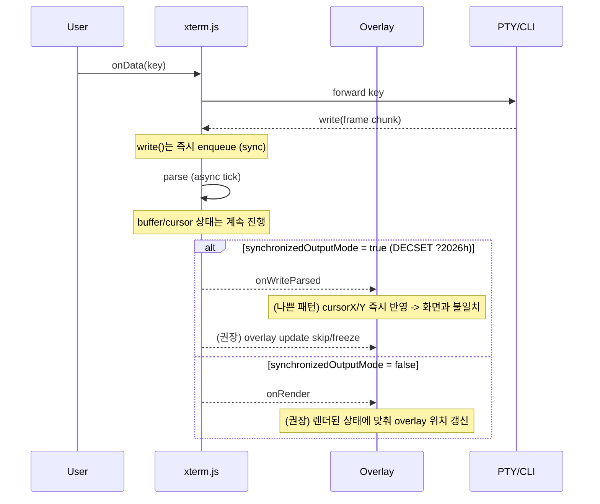

# xterm.js에서 잦은 footer/status repaint 시 cursorX/Y가 "프롬프트"가 아니라 "마지막 repaint 지점"으로 이동하는 현상 분석 보고서

## 초록과 요약

이 현상은 대부분 "버그처럼 보이지만 설계·프로토콜·동기화의 경계에 걸린 문제"로 분류된다. xterm.js의 `buffer.active.cursorX/Y`는 **터미널 에뮬레이터가 마지막으로 처리한 출력(ANSI/VT 시퀀스 포함) 기준의 '터미널 커서' 상태**를 나타낸다. 즉, 어떤 프로그램이 footer/status를 그리기 위해 커서를 화면 하단으로 이동해 출력하면(그리고 그 상태가 최종 상태로 남으면) `cursorX/Y`는 그 위치를 가리키는 것이 정상 동작일 수 있다.

문제는 실제 사용자 입력 프롬프트(혹은 앱이 논리적으로 정의한 입력 영역)가 따로 있고, 당신이 **native cursor를 숨기며 overlay cursor를 직접 그릴 때** "논리 커서"가 아니라 "터미널 커서"를 따라가게 되면서, footer line 끝(마지막 repaint 위치)로 점프/고착되는 형태로 나타난다는 점이다.

특히 아래 두 조건이 겹치면 증상이 매우 전형적으로 재현된다.

- **앱이 화면을 '프레임' 단위로 자주 다시 그리는 TUI/interactive CLI**이고, 그 과정에서 커서를 하단/특정 위치로 이동해 footer/status를 갱신한다.
- 앱이 **DECSET 2026 (Synchronized Output)** 를 사용해 "렌더링만 지연"시키는 동안 xterm.js는 **버퍼/커서 상태는 계속 갱신**한다. 이때 overlay가 `cursorX/Y`를 즉시 반영하면, 사용자가 보는 화면(마지막 렌더 상태)과 overlay가 참조하는 내부 상태(렌더 지연 중 누적된 최신 상태)가 어긋나 "커서가 footer로 점프"한 것처럼 보이거나, 프레임 종료 시점의 마지막 커서 위치(footer 끝)로 고착된 것처럼 보인다.

실무적으로 가장 효과적인 권고는 우선순위대로 요약하면 다음과 같다.

1) **overlay cursor를 "렌더 기준"으로 동기화**: `onRender` 중심으로 업데이트하고, `terminal.modes.synchronizedOutputMode`가 켜진 동안은 overlay를 **freeze**한다(또는 ESU 이후 첫 렌더에서만 갱신).
2) footer/status 갱신이 "커서 저장/복원"에 의존한다면, **`CSI s/u` 대신 `ESC 7/8`(SC/RC)을 우선**하거나(또는 스트림 레벨에서 안전 변환) "중첩 save/restore"를 피한다. xterm.js는 `CSI s/u`를 "Partial"로 표기하고 있다.
3) "프롬프트(입력 영역) 위치"가 필요하다면, **프롬프트 마커(OSC 133 등)** 로 **논리적 프롬프트 경계**를 명시하고, xterm.js의 `registerOscHandler`/`registerMarker`로 prompt line을 안정적으로 추적하는 설계를 1순위로 고려한다.
4) 마커가 불가능하면, buffer line inspection + regex로 "프롬프트 후보 라인"을 추정하되, wrapped line/속성/탭/가변 프롬프트 등의 함정을 전제로 방어적으로 구현한다.
5) 마지막으로, repaint 출력과 user input(에코/라인 편집)을 **한 스트림으로 직렬화(단일 writer)** 하고, `write` 콜백/프레임 큐/스로틀링으로 race를 예방한다. xterm.js의 write 파이프라인은 "enqueue는 즉시, parse/상태 갱신은 async tick" 구조이므로(그리고 렌더는 더 늦을 수 있으므로) 동기화 전략이 중요하다.

## 문제 재현 조건과 "왜 cursorX/Y가 footer로 가는가"

현상을 안정적으로 재현하는 조건을 "터미널 프로토콜 관점"으로 정리하면 다음과 같다.

- 애플리케이션이 footer/status를 업데이트하기 위해 **절대 커서 이동(CUP 등)** 및 **라인 지우기(EL/ED)** 를 사용한다.
- 업데이트 전후에 커서를 원래 입력 위치로 되돌리기 위해 **커서 저장/복원**을 사용한다. 이때 구현/호환성 차이로 `CSI s`/`CSI u`를 쓰거나, 또는 중첩된 저장/복원(하나의 save 슬롯을 여러 기능이 공유)로 인해 restore가 기대대로 되돌리지 못하면, "마지막으로 출력한 위치"가 커서의 최종 상태로 남는다.
- 또는 애플리케이션이 **DECSET 2026**을 통해 "렌더가 지연되는 동안 여러 커서 이동과 출력"을 수행하고, overlay가 내부 `cursorX/Y`를 즉시 반영하면 사용자가 보는 상태(마지막 렌더)와 overlay가 참조하는 상태(최신 파싱 결과)가 분리되어 보인다.

여기서 핵심은, xterm.js의 `buffer.active.cursorX/Y` 자체가 "프롬프트 커서"를 뜻하지 않는다는 점이다. 공식 API 관점에서 이는 "버퍼의 커서 위치"이며(`cursorX`는 0..cols, `cursorY`는 baseY 기준 0..rows-1), 어떤 프로그램이 화면의 다른 곳에 커서를 두고 출력을 끝내면 그 값은 그 위치를 가리키는 것이 정상이다.

추가로, 프롬프트가 "논리적 개념"으로만 존재하고(예: TUI 내부 입력 위젯), 터미널 커서는 단지 화면을 그리기 위한 도구라면, **커서의 '진짜 입력 위치'는 애플리케이션 내부 상태**이지 터미널 커서가 아니다. 이런 경우 overlay cursor가 `cursorX/Y`만으로 "프롬프트 위치"를 찾는 시도 자체가 구조적으로 불안정해진다.

## 관련 xterm.js 내부/공개 API와 상태 모델

이 문제를 다루려면 xterm.js의 "버퍼/커서/이벤트/훅" 모델을 정확히 잡아야 한다.

xterm.js는 normal/alt 두 버퍼를 가지며, embedder는 `terminal.buffer.active`를 통해 현재 활성 버퍼를 읽는다. 활성 버퍼의 `cursorX/Y`는 "현재 커서 위치"다.
또한 `IBufferLine`은 `isWrapped`(이전 라인에서 soft-wrap 되었는지)와 `translateToString`(단, wrapped를 자동 결합하지 않음)을 제공한다. "프롬프트 문자열을 라인 단위로 해석"하려면 이 제약을 반드시 고려해야 한다.

셀 단위 분석이 필요하면 `IBufferLine.getCell`과 `IBufferCell` API로 문자와 폭(1/2/0), 전경/배경 색 모드 등을 얻을 수 있다(프롬프트 탐지에서 "스타일 패턴"을 힌트로 쓰는 방식에 활용 가능).

이벤트 측면에서 overlay 동기화에 특히 중요한 것은 다음이다.

- `onWriteParsed`: "write된 데이터가 파싱되어 버퍼 상태가 바뀐 뒤" 발생하며, 프레임당 최대 1회로 제한될 수 있고, 데이터가 많으면 아직 pending write가 남은 상태에서도 발생할 수 있다. 즉, **버퍼 상태의 '중간 지점'** 에서도 뜰 수 있다.
- `onRender`: 실제로 특정 row 범위가 렌더될 때 발생한다(overlay를 "사용자가 보는 화면"과 맞추려면 이 이벤트를 축으로 삼는 것이 유리하다).

또 하나의 매우 중요한 사실: **터미널 버퍼는 "시퀀스 처리 후 결과 상태"만 저장한다. 원본 escape sequence(예: 프롬프트 마커 OSC 등)는 버퍼에서 복원할 수 없다.** 따라서 프롬프트 마커/프레임 마커/기타 메타데이터를 활용하려면 "입력 스트림을 파싱 시점에 훅으로 잡거나, 입력 스트림을 pre-parse해야" 한다.

## ANSI/VT 시퀀스와 DECSET 2026의 영향

### footer/status repaint가 커서를 건드리는 대표 패턴

상태바/풋터를 그리는 CLI는 보통 아래 요소를 조합한다.

- 커서를 특정 위치로 이동: `CUP`(CSI row;col H), `CHA`(CSI col G), `VPA`(CSI row d) 등.
- 지우기: `EL`(CSI Ps K), `ED`(CSI Ps J) 등.
- 스크롤 영역 조정(본문은 스크롤, footer는 고정): `DECSTBM`(CSI top;bottom r).
- 커서 숨김/표시: DECTCEM (DECSET/DECRST 25).
- 커서 저장/복원:
  - `ESC 7` / `ESC 8` (SC/RC) — xterm.js는 지원 ✓ 로 표기.
  - `CSI s` / `CSI u` (SCOSC/SCORC) — xterm.js는 **Partial** 로 표기.

특히 `CSI s/u` 계열은 OS/터미널/라이브러리별 편차가 크고, xterm.js에서도 장기간 "부분 지원/호환성 이슈"가 관찰되어 왔다. 예컨대 과거 이슈에서 **ESC 7(DECSC)은 정상인데 CSI s(ANSI.SYS)는 저장된 X/Y가 항상 0으로 들어오는** 재현이 보고되었다.
따라서 "footer repaint 후 cursorX/Y가 엉뚱한 곳으로 간다"가 `CSI s/u`와 연관되어 있다면, **시퀀스 선택 자체가 문제의 근원**일 가능성이 있다.

### alternate screen/state가 섞일 때의 함정

TUI가 alternate screen을 사용하면(DECSET 47/1047/1049 등), "프롬프트/스크롤백/마커"의 의미가 달라진다. xterm.js는 alternate buffer 관련 모드들을 지원하며(1049는 Partial로 표기),
또한 공개 API 상 `Terminal.markers`는 "alt buffer가 active이면 항상 빈 배열"이라고 명시한다. 즉, prompt line 추적을 마커로 구현한다면 alt screen에서는 설계를 달리해야 한다.

### DECSET 2026 (Synchronized Output)의 핵심 의미

DECSET 2026은 "프레임 단위로 화면을 원자적으로 갱신(테어링 방지)"하기 위한 확장이다.

- 의미(프로토콜 관점): 모드가 enabled인 동안 터미널은 "렌더를 마지막 상태로 고정"하고, 들어오는 텍스트/시퀀스를 계속 처리한다. 모드가 disabled되면 최신 버퍼 상태를 한 번에 렌더한다.
- xterm.js 공개 API 관점: `terminal.modes.synchronizedOutputMode`는 `CSI ? 2026 h`로 켜지는 모드이며, "enabled일 때 output이 버퍼링되고 모드가 꺼질 때 렌더된다"라고 문서화되어 있다.
- 구현/출처(이슈/PR): xterm.js에 synchronized output 지원이 추가되면서, BSU(`CSI ? 2026 h`)로 렌더 지연, ESU(`CSI ? 2026 l`)로 flush, DECRQM(`CSI ? 2026 $ p`)로 지원 여부 질의가 가능하다는 요약이 PR에 명시되어 있다.
- 릴리스 노트에서도 synchronized output 지원(#5453) 및 `onWriteParsed` API 노출(#5034)이 함께 언급된다.

이 모드는 바로 당신의 증상(overlay cursor)과 "정면 충돌"하기 쉽다. 왜냐하면 **렌더는 멈춰도 커서/버퍼 상태는 진행**되기 때문이다.
즉 overlay cursor가 `onWriteParsed`나 별도 타이머에서 계속 `buffer.active.cursorX/Y`를 읽어 그리면, 사용자 눈에는 "아직 화면이 바뀌지 않았는데 커서만 footer로 점프/스윕"하는 것처럼 보일 수 있다(또는 프레임 종료 시점의 마지막 커서 위치로 고착). 이는 "cursorX/Y 자체가 틀렸다"기보다 "overlay가 렌더 타이밍과 분리되어 내부 상태를 앞질러 본다"에 가깝다.

## prompt line detection과 buffer line inspection 기법 비교

### prompt marker 기반: OSC 133 (권장)

프롬프트를 "정규식"으로 추측하기보다, 애플리케이션이 **프롬프트 시작/종료를 명시적으로 마킹**하는 방식이 가장 견고하다.

- Contour 문서(표준화된 설명 형태)에서 OSC 133은 `OSC 133 ; <Command> ... ST` 포맷이며, **A=Prompt Start, B=Prompt End, C=Command Output Start, D=Command Finished**로 정의한다.
- VS Code 문서도 FinalTerm 호환으로 `OSC 133 ; A/B/C/D`를 지원한다고 명시한다.
- iTerm2 문서 역시 FinalTerm 시퀀스의 목적(프롬프트/커맨드/출력 경계 의미화)을 설명하며 `OSC 133 ; A/B/C/D`를 서술한다.

xterm.js 자체가 OSC 133을 "기본 기능으로 처리"하지 않더라도(터미널마다 의미가 다를 수 있음), embedder는 **parser hook**으로 OSC 133을 잡아 prompt 경계를 추적할 수 있다. xterm.js는 OSC를 포함해 ESC/CSI/DCS/OSC에 대한 parser hook 등록을 공식적으로 안내한다.

그리고 prompt line을 추적할 때 `Terminal.registerMarker()`를 함께 쓰면, 스크롤백이 늘거나 trim 되어도 "프롬프트 라인"을 안정적으로 따라갈 수 있다(단, normal buffer에만 추가됨).

### 정규식 기반 prompt detection (보조/차선책)

마커를 넣을 수 없고, 외부 CLI를 "그대로 임베드"해야 한다면 결국 화면 텍스트로 추정해야 한다.

이때 xterm.js buffer inspection의 실무 포인트는 다음이다.

- `IBufferLine.translateToString()`은 "그 라인만 문자열로" 반환하며, `isWrapped`를 자동 반영하지 않는다. 즉 프롬프트가 줄바꿈/랩된 경우, **wrapped line을 결합**해 비교해야 한다.
- `IBufferLine.length`는 resize 이후 columns보다 길 수 있다. 따라서 "실제 보이는 최대 길이"는 `Terminal.cols`을 기준으로 자르는 편이 안전하다.
- 셀 단위로 가면, `getWidth()`가 2인 wide char(동아시아 폭)나 0(와이드 후행 셀) 같은 케이스가 있어 "문자 인덱스==컬럼"이 깨질 수 있다.
- 그리고 가장 큰 함정: 터미널 버퍼에는 **원본 escape sequence가 남지 않는다**. 즉 "이 라인이 프롬프트인지"를 SGR/OSC 같은 원본 시퀀스로 판별하는 것은 불가능하며, 프롬프트 마커가 필요하면 스트림에서 미리 잡아야 한다.

정규식 prompt detection은 결국 "프롬프트 스타일이 어느 정도 안정적"이라는 전제가 있어야 하고, 다국어/색상/동적 정보(경로, git branch 등)에서는 false positive/negative를 피하기 어렵다.

## 구현 패턴과 설계 권고: parser hooks, state tracking, overlay cursor, race 방지

### 이벤트 흐름을 "렌더 기준"으로 재정렬하기

xterm.js의 입력 파이프라인은 다음이 핵심이다.

- `term.write(...)`는 **동기적으로 write buffer에 enqueue**하고 즉시 반환한다.
- 실제 파싱(시퀀스 처리)과 터미널 상태 갱신은 **비동기 tick**에서 일어난다.
- `onWriteParsed`는 프레임당 최대 1회이며, heavy input 시 pending write가 남아도 발생 가능하므로, overlay/프롬프트/UI 동기화 기준으로는 "렌더/모드 상태"를 함께 고려해야 한다.
- 렌더는 그 다음 단계이며, synchronized output에서는 렌더가 의도적으로 지연될 수 있다.

따라서 overlay cursor를 "버퍼 상태 변화"마다 움직이면(특히 sync output 중), 사용자가 보는 렌더 상태와 mismatch가 나기 쉽다.

권장 패턴은 다음 두 가지를 조합하는 것이다.

- overlay 위치 업데이트는 `onRender`에서만 수행한다(= 실제 화면이 갱신될 때만 움직인다).
- `terminal.modes.synchronizedOutputMode`가 true인 동안은 overlay 업데이트를 **freeze**한다(혹은 ESU 직후 첫 onRender에서만 갱신).

아래 mermaid는 "잘못된 설계(버퍼 기준)"와 "권장 설계(렌더 기준 + sync freeze)"의 차이를 개략화한다.



### parser hooks로 "프롬프트/프레임/커서 이동"을 관측하는 구현 예시

아래 예시는 3가지를 목표로 한다.

1) OSC 133 기반 프롬프트 경계 수신 시 prompt 라인에 marker를 찍어 추적
2) DECSET 2026 활성 여부에 따라 overlay 업데이트를 억제
3) alt buffer 진입 시 prompt logic을 중지(또는 별도 로직)

xterm.js는 OSC/CSI/ESC/DCS에 대한 parser hooks를 공식 API로 제공하며, hook은 빠르고 동기적으로 끝내야 한다.
또한 `registerMarker`로 normal buffer에 마커를 추가할 수 있다.

```ts
import type { Terminal, IMarker } from '@xterm/xterm';

type PromptState = {
  promptMarker?: IMarker;
  promptLine?: number; // buffer absolute line index
  inAlt: boolean;
};

export function attachPromptAndSyncTracking(term: Terminal) {
  const state: PromptState = { inAlt: false };

  // 1) 현재 buffer 종류 추적 (normal/alternate)
  term.onWriteParsed(() => {
    state.inAlt = term.buffer.active.type === 'alternate';
  });

  // 2) OSC 133: 프롬프트 start/end를 훅으로 수신
  //    Contour/VS Code/iTerm2 문서에서 A=Prompt Start, B=Prompt End. (ST는 ESC\ 또는 BEL)
  term.parser.registerOscHandler(133, (data) => {
    // data 예: "A", "A;click_events=1", "B", "C", "D;0" 등
    const cmd = data.split(';', 1)[0];

    if (state.inAlt) return false; // alt buffer에서는 마커/프롬프트 추적을 보통 비활성화

    if (cmd === 'A') {
      // Prompt Start: "현재 라인을 prompt line으로 마크"하는 의미
      // Marker는 normal buffer에만 유효
      state.promptMarker?.dispose?.();
      state.promptMarker = term.registerMarker(0);
      if (state.promptMarker) {
        state.promptLine = state.promptMarker.line;
      }
    }

    if (cmd === 'B') {
      // Prompt End: 사용자 입력이 시작되는 지점
      // 이 시점의 커서/라인을 "입력 시작 기준점"으로 저장하는 전략이 흔함
    }

    return false; // 기본 핸들러(없으면 무시) 계속
  });

  return state;
}
```

주의: 위 코드는 "프롬프트 라인"을 잡을 뿐, "입력 caret의 X 위치"는 별도의 상태(입력 위젯이 내부적으로 관리하는 cursor idx)를 함께 추적해야 한다. OSC 133은 경계 정보를 주지만 "현재 편집 커서의 column"까지 정해주지는 않는다.

### buffer line inspection (wrapped line 결합 포함) 예시

마커가 없을 때(또는 보조 검증용) "마지막 프롬프트 후보"를 찾는 최소 구현 패턴은 보통 다음 순서를 따른다.

- 후보 라인 범위를 최근 N라인으로 제한(성능)
- 각 라인에 대해 `translateToString`으로 문자열을 얻고
- `isWrapped` 관계를 따라 "논리 라인"으로 결합
- 정규식으로 프롬프트 패턴 매칭

xterm.js는 `isWrapped`와 `translateToString`를 제공하지만, `translateToString`은 wrapped를 반영하지 않는다고 명시한다.

```ts
import type { Terminal } from '@xterm/xterm';

function getLogicalLineString(term: Terminal, absLine: number): string {
  const buf = term.buffer.active;

  const head = buf.getLine(absLine);
  if (!head) return '';

  // 현재 라인부터 시작해, 다음 라인들이 isWrapped=true이면 이어붙인다.
  let s = head.translateToString(true, 0, term.cols);

  let next = absLine + 1;
  while (true) {
    const ln = buf.getLine(next);
    if (!ln || !ln.isWrapped) break;
    s += ln.translateToString(true, 0, term.cols);
    next++;
  }
  return s;
}

export function findPromptCandidate(term: Terminal, promptRegex: RegExp, lookback = 200) {
  const buf = term.buffer.active;
  const bottomAbs = buf.baseY + (term.rows - 1);
  const start = Math.max(0, bottomAbs - lookback);

  for (let y = bottomAbs; y >= start; y--) {
    const text = getLogicalLineString(term, y);
    if (promptRegex.test(text)) {
      return { absLine: y, text };
    }
  }
  return undefined;
}
```

이 접근법은 "프롬프트가 화면에 텍스트로 남아있고 패턴이 안정적"일 때만 실용적이다. TUI가 화면을 계속 덮어쓰면(특히 alternate screen) 신뢰도가 급격히 낮아진다.

### overlay cursor 구현 패턴 (성능/동기화 고려)

overlay cursor는 대개 "CSS absolute layer + transform"이 가장 단순하다. 핵심은 **업데이트 빈도 제어**와 **동기화 기준(렌더 vs 파싱)** 이다.

- `onRender`에서만 overlay를 갱신
- synchronized output 모드 중에는 갱신 freeze
- 필요 시 footer repaint 중(특정 패턴)에는 갱신 잠금
- 버퍼 스캔은 키 입력마다 하지 말고, debounce/throttle로 제한

또한 xterm.js는 `writeSync`가 "async parser handler 환경에서 신뢰할 수 없으며 제거 예정"이라며, blocking semantics가 필요하면 `write` + callback을 쓰라고 경고한다. 이는 "프레임/리페인트를 직렬화"하려는 embedder 설계에서 중요한 근거가 된다.

## 우선순위별 권장 접근법과 비교표, 관련 이슈/PR 사례 요약

### 비교표

| 접근법 | 핵심 아이디어 | 장점 | 단점/주의 | 구현 난이도 | 권장도 |
|---|---|---|---|---|---|
| 렌더 기준 overlay + sync freeze | `onRender`에서만 overlay 갱신, `modes.synchronizedOutputMode` 중엔 freeze | DECSET 2026 환경에서 "커서 점프"를 가장 직접적으로 완화 | 입력 caret이 별도(논리 커서)면 추가 추적 필요 | 중 | ★★★★★ |
| 커서 저장/복원 시퀀스 정리 | footer 갱신이 커서를 원복하도록 `ESC 7/8` 우선, `CSI s/u` 의존 줄이기 | "cursorX/Y가 footer에 고착"되는 근본 원인 제거 가능 | 외부 CLI를 수정/랩핑해야 할 수 있음 | 중~상 | ★★★★☆ |
| 프롬프트 마커(OSC 133 등) 도입 | prompt start/end를 시퀀스로 명시하고 hook으로 추적 + marker | 프롬프트 탐지 정확도/견고성이 가장 높음 | 외부 CLI 수정 필요(또는 프록시 주입) | 중 | ★★★★★ |
| parser hooks로 footer repaint 구간 감지 | CUP/DECSTBM/DECSC/DECRC 등 훅으로 "상태바 업데이트 중"을 감지해 overlay 잠금 | 외부 CLI 수정 없이도 "잠금/해제"로 체감 개선 | 시퀀스 패턴이 앱마다 달라 휴리스틱이 됨 | 상 | ★★★☆☆ |
| buffer scan + regex | 최근 라인에서 prompt 패턴을 탐색, wrapped 결합 | 마커 없는 환경에서 유일한 보편적 방법 | false pos/neg 많고 TUI/alt screen에 취약 | 중 | ★★☆☆☆ |
| 입력/상태 UI를 터미널 밖으로 분리 | footer/status/input을 DOM/UI로 구현, 터미널은 로그 출력만 | 가장 안정적. 커서/시퀀스 문제를 거의 제거 | "진짜 터미널 호환"이 훼손될 수 있음(TUI/프로그램 실행) | 상 | 상황 의존 |

### 관련 xterm.js 이슈/PR/문서의 핵심 요약

- Synchronized Output(DECSET 2026) 지원이 xterm.js에 추가되었고, BSU/ESU/DECRQM 시퀀스 및 렌더 지연/원자적 flush가 PR에 요약되어 있다.
- Synchronized output의 의미는 "렌더는 마지막 상태로 유지하지만, 터미널은 텍스트/시퀀스를 계속 처리"라는 점이 핵심이며, 이는 overlay가 파싱 상태를 즉시 반영할 때 mismatch를 유발할 수 있다.
- xterm.js의 Supported Terminal Sequences 문서에서 `SCOSC/SCORC (CSI s/u)`가 **Partial**로 표기되고, `SC/RC (ESC 7/8)`는 지원 ✓ 로 표기된다. 또한 alt buffer 관련 DECSET/DECRST 목록(47/1047/1049 등)과 DECTCEM(25), DSR(CPR 요청) 지원 등이 명시된다.
- 과거 이슈에서 "Midnight Commander가 ESC 7과 CSI s를 모두 보내는데, CSI s로 저장한 좌표는 항상 0"이라는 보고가 존재한다(즉 CSI s/u 의존 설계가 cursor 복원 실패로 이어질 수 있음을 시사).
- `onWriteParsed`는 "버퍼 변화 감지"에 유용하지만 프레임당 최대 1회이며 pending write가 남아도 발생 가능하므로, overlay/프롬프트/UI 동기화 기준으로는 "렌더/모드 상태"를 함께 고려해야 한다.
- 터미널 버퍼에서 원본 escape sequence를 다시 얻을 수 없고(시퀀스 처리 후 상태만 저장), 지원하지 않는 시퀀스는 조용히 소비될 수 있으므로, 시퀀스 기반 메타데이터는 스트림 pre-parse 또는 parser hook으로 잡아야 한다.

### 원문 링크 모음

```text
xterm.js Parser Hooks 가이드
https://xtermjs.org/docs/guides/hooks/

xterm.js Supported Terminal Sequences (vtfeatures)
https://xtermjs.org/docs/api/vtfeatures/

xterm.js IBuffer / IBufferLine / IBufferCell / IMarker / Terminal API
https://xtermjs.org/docs/api/terminal/interfaces/ibuffer/
https://xtermjs.org/docs/api/terminal/interfaces/ibufferline/
https://xtermjs.org/docs/api/terminal/interfaces/ibuffercell/
https://xtermjs.org/docs/api/terminal/interfaces/imarker/
https://xtermjs.org/docs/api/terminal/classes/terminal/
https://xtermjs.org/docs/api/terminal/interfaces/imodes/

xterm.js PR: DECSET 2026 synchronized output
https://github.com/xtermjs/xterm.js/pull/5453
xterm.js Issue: Synchronized Output tracker
https://github.com/xtermjs/xterm.js/issues/3375
xterm.js Releases (6.0.0 포함)
https://github.com/xtermjs/xterm.js/releases

xterm.js Issue: CSI s 저장 좌표 문제(과거 사례)
https://github.com/xtermjs/xterm.js/issues/229

xterm.js Discussion: 버퍼에서 원본 escape sequence를 얻을 수 없음
https://github.com/xtermjs/xterm.js/discussions/5113
xterm.js Discussion: 커서 위치는 term.buffer.active.cursorX 등 공개 API를 쓰라는 답변
https://github.com/xtermjs/xterm.js/discussions/4392

Contour VT extensions: synchronized output / OSC 133
https://contour-terminal.org/vt-extensions/synchronized-output/
https://contour-terminal.org/vt-extensions/osc-133-shell-integration/

VS Code Terminal Shell Integration (OSC 133 지원 언급 포함)
https://code.visualstudio.com/docs/terminal/shell-integration

iTerm2 Proprietary Escape Codes (OSC 133 설명 포함)
https://iterm2.com/3.4/documentation-escape-codes.html

(참고) Codex 관련 커서/리페인트 이슈 예시
https://github.com/openai/codex/issues/9081
https://github.com/openai/codex/issues/2805
```
